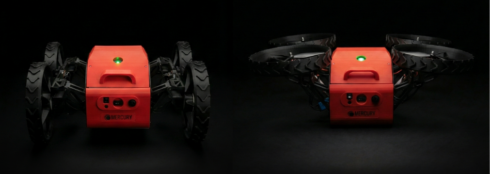

# MERCURY - TRANSFORMING DRONE
<!-- Hardware / Platform -->




[](https://buymeacoffee.com/mercuriustech)
[](https://x.com/L42ARO)


## Quick Index

- [Demo](#demo)
- [Features](#features)
- [Folder Structure](#folder-structure)
- [Software Setup](#software-setup)

## Demo

[](https://youtu.be/DZhdSxqXiKo)

## Features

<table width="100%">
  <tr>
    <td width="50%" align="center"><b>Inner Payload Bay (1 kg)</b></td>
    <td width="50%" align="center"><b>Simple Transformation Mechanism</b></td>
  </tr>
  <tr>
    <td width="50%" align="center"></td>
    <td width="50%" align="center"></td>
  </tr>
</table>

<table width="100%">
  <tr>
    <td width="50%" align="center"><b>RGB + Depth + Thermal Cameras</b></td>
    <td width="50%" align="center"><b>Ardupilot + GPS</b></td>
  </tr>
  <tr>
    <td width="50%" align="center"></td>
    <td width="50%" align="center"></td>
  </tr>
</table>

<table width="100%">
  <tr>
    <td width="50%" align="center"><b>Wheel + Prop Guard</b></td>
    <td width="50%" align="center"><b>Mobile App</b></td>
  </tr>
  <tr>
    <td width="50%" align="center"></td>
    <td width="50%" align="center"></td>
  </tr>
</table>

## Folder Structure
- **STL Files:** all the required stl files for the drone assembly
- **Autonomy Software:** all the required software for the drone autonomy
- **PCB Files:** all the gerber files for the drone PCBs

## Software Setup

To use the software as it is, upload the Autonomy Software folder to a Raspberry Pi 5, using your preferred SCP method. For beginners we recommend [WinSCP](https://winscp.net/eng/download.php).

Inside the folder in the raspberry pi create a virtual environment and install the dependencies.

```bash
python3 -m venv venv
source venv/bin/activate
pip install -r requirements.txt
```

You must run both the Mavproxy Bridge to interface with the flight controller as well as the main software powering the rest of the robot. For that run in two separate temrinals the scripts:

```bash
start_mavproxy.sh
```
```bash
run.sh
```
In the terminal you should see the IP addres to be able to control the robot, if you're connected to the same network just copy paste that on your browser.

If you would like to be able to control it from different networks and at long distances we recommend you setup [Tailscale](https://tailscale.com/) on your devices.

For more convenience you can setup these scripts to run automatically on startup, and then use other scripts like `restarter.sh` or `killer.sh` to manage them.

## 🧑‍💻 Official Codebase Core Contributors and Maintainers

<table>
  <tr>
    <td align="center">
      <a href="https://x.com/L42ARO">
        
      </a>
      <br />
      <sub><b>Alvaro L</b></sub>
    </td>
    <td align="center">
      <a href="https://x.com/pericleshimself">
        
      </a>
      <br />
      <sub><b>Connor Raymer</b></sub>
    </td>
  </tr>
</table>


[](https://buymeacoffee.com/mercuriustech)

