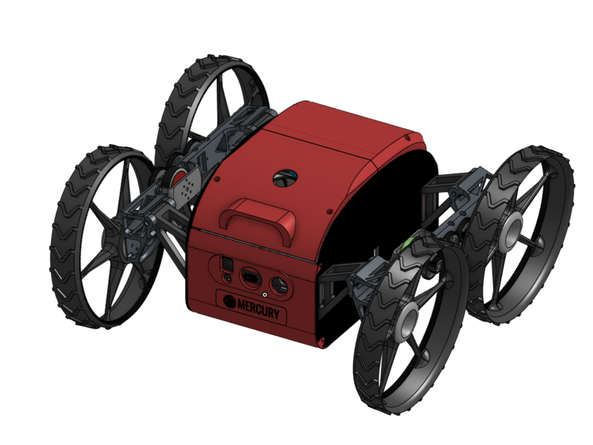

# MERCURY - TRANSFORMING DRONE
<!-- Hardware / Platform -->


[](https://buymeacoffee.com/mercuriustech)
[](https://www.patreon.com/c/MercuriusTech)
[](https://x.com/L42ARO)


## Quick Index

- [Folder Structure](#folder-structure)
- [Bill of Materials](#bill-of-materials)
- [CAD Files](#cad-files)
- [Software Setup](#software-setup)

## Folder Structure
- **STL Files:** all the required stl files for the drone assembly
- **Autonomy Software:** all the required software for the drone autonomy
- **PCB Files:** all the gerber files for the drone PCBs

## Bill of Materials

| Hardware | Units | Link |
|----------|-------|------|
| 120N Linear Actuator 1.2" | 2 | [Buy](https://a.co/d/f1gvmVA) |
| 8 inch propellers | 4 | [Buy](https://a.co/d/bCJhVNM) |
| BLDC Motor (A2812 2812 900KV) | 4 | [Buy](https://a.co/d/0YZLBnR) |
| Raspberry Pi 5 | 1 | [Buy](https://a.co/d/0e89eMiw) |
| Mobile Data Dongle | 1 | [Buy](https://a.co/d/clkxkL8) |
| Lipo Battery (3S 2200mah) | 2 | [Buy](https://a.co/d/04b29lgE) |
| Screws (3mm x 10mm) | 10 | ACE Hardware |
| Screws (3mm x 30mm) | 20 | ACE Hardware |
| Screws (3mm x 50mm) | 10 | ACE Hardware |
| CF 30 cm x 30 cm (for frame) | 2 | [Buy](https://a.co/d/0dzbtn5p) |
| 8 awg cable | 1 | [Buy](https://www.amazon.com/dp/B07B8N6751) |
| T Plug Pairs | 2 | [Buy](https://www.amazon.com/dp/B01C8NWJ78) |
| XT60 Male & Female | 1 | [Buy](https://www.amazon.com/dp/B0CMM1BBDQ) |
| IMU (MPU 9250) | 2 | [Buy](https://www.amazon.com/dp/B01I1J0Z7Y) |
| TOF Camera | 1 | [Buy](https://www.amazon.com/dp/B0BRB12W7Y) |
| ESP32S3 | 1 | [Buy](https://a.co/d/0fMawJYb) |
| USB Webcam | 1 | [Buy](https://a.co/d/dZ3TK0W) |
| Buck Converter | 3 | [Buy](https://a.co/d/iBVBORv) |
| Radiolink R8XM | 1 | [Buy](https://www.amazon.com/dp/B0BCPDLWXZ) |
| DRV8871 H Bridge | 2 | [Buy](https://a.co/d/iBVBORv) |
| Cube + Flight Controller | 1 | [Buy](https://a.co/d/19FUWXO) |
| SEQURE 4in1 ESC 70A | 1 | [Buy](https://a.co/d/5X12oWn) |
| Custom PCBs | 3 | EasyEDA |
| BLDC Motor 140KV (for driving) | 2 | [Buy](https://a.co/d/iKZayiN) |
| Optical Flow MTF-01 | 1 | [Buy](https://www.ewingaerospace.com/products/ewing-aerospace-h7-flight-controller-ndaa-compliant-and-blueuas) |
| Thermal Camera | 1 | [Buy](https://a.co/d/dZ3TK0W) |
| Bidirectional ESC 50A (for driving) | 2 | [Buy](https://a.co/d/00C138fG) |

## CAD Files



The STL files are available to download in the [STL Files](STL%20Files) folder. For full access to the full CAD project [JOIN OUR PATERON](https://www.patreon.com/c/MercuriusTech)

| Name | Qty | Material | Density |
|------|-----|----------|---------|
| [Arm - Left](STL%20Files/Arm%20-%20Left.stl) | 1 | Black PLA-CF | 10% |
| [Arm - Right](STL%20Files/Arm%20-%20Right.stl) | 1 | Black PLA-CF | 10% |
| [BLDC Holder - Left](STL%20Files/BLDC%20Holder%20-%20Left.stl) | 1 | Black PLA-CF | 10% |
| [BLDC Holder - Right](STL%20Files/BLDC%20Holder%20-%20Right.stl) | 1 | Black PLA-CF | 10% |
| [CargoBay - Base](STL%20Files/CargoBay%20-%20Base.stl) | 1 | Black PLA-CF | 10% |
| [CargoBay - Battery Holder 1](STL%20Files/CargoBay%20-%20Battery%20Holder%201.stl) | 1 | Black PLA-CF | 10% |
| [CargoBay - Battery Holder 2](STL%20Files/CargoBay%20-%20Battery%20Holder%202.stl) | 1 | Black PLA-CF | 10% |
| [CargoBay - Battery Holder 3](STL%20Files/CargoBay%20-%20Battery%20Holder%203.stl) | 1 | Black PLA-CF | 10% |
| [CargoBay - Battery Holder 4](STL%20Files/CargoBay%20-%20Battery%20Holder%204.stl) | 1 | Black PLA-CF | 10% |
| [CargoBay - Cover](STL%20Files/CargoBay%20-%20Cover.stl) | 1 | White Aero PLA | 0–5% |
| [Cover - Base](STL%20Files/Cover%20-%20Base.stl) | 1 | Black PLA-CF | 10% |
| [Cover Out - Bottom](STL%20Files/Cover%20Out%20-%20Bottom.stl) | 1 | Red PLA | 0–5% |
| [Cover Out - Front Name](STL%20Files/Cover%20Out%20-%20Front%20Name.stl) | 1 | Red PLA | 0–5% |
| [Cover Out - Front Sensors](STL%20Files/Cover%20Out%20-%20Front%20Sensors.stl) | 1 | Red PLA | 0–5% |
| [Cover Out - Front](STL%20Files/Cover%20Out%20-%20Front.stl) | 1 | Red PLA | 0–5% |
| [Cover Out - Rear](STL%20Files/Cover%20Out%20-%20Rear.stl) | 1 | Red PLA | 0–5% |
| [Cover Out - Top Front](STL%20Files/Cover%20Out%20-%20Top%20Front.stl) | 1 | Red PLA | 0–5% |
| [Cover Out - Top Rear](STL%20Files/Cover%20Out%20-%20Top%20Rear.stl) | 1 | Red PLA | 0–5% |
| [Drone Motor Holder](STL%20Files/Drone%20Motor%20Holder.stl) | 1 | Black PLA-CF | 10% |
| [Gear - Central](STL%20Files/Gear%20-%20Central.stl) | 2 | Black PLA-CF | 10% |
| [Gear - Driving](STL%20Files/Gear%20-%20Driving.stl) | 2 | Black PLA-CF | 10% |
| [Gear - Peripheral](STL%20Files/Gear%20-%20Peripheral.stl) | 2 | Black PLA-CF | 10% |
| [Linear Actuator Holder](STL%20Files/Linear%20Actuator%20Holder.stl) | 2 | Black PLA-CF | 10% |
| [ShoulderMount - Front](STL%20Files/ShoulderMount%20-%20Front.stl) | 1 | Black PLA-CF | 10% |
| [ShoulderMount - Rear](STL%20Files/ShoulderMount%20-%20Rear.stl) | 1 | Black PLA-CF | 10% |
| [Wheel - Left](STL%20Files/Wheel%20-%20Left.stl) | 2 | Black PLA-CF | 10% |
| [Wheel - Right](STL%20Files/Wheel%20-%20Right.stl) | 2 | Black PLA-CF | 10% |
| [Frame Side Blueprint](STL%20Files/Frame%20Side%20Blueprint.pdf) | 2 | Carbon Fiber Sheet | N/A |

## Software Setup

To use the software as it is, upload the Autonomy Software folder to a Raspberry Pi 5, using your preferred SCP method. For beginners we recommend [WinSCP](https://winscp.net/eng/download.php).

Inside the folder in the raspberry pi create a virtual environment and install the dependencies.

```bash
python3 -m venv venv
source venv/bin/activate
pip install -r requirements.txt
```

You must run both the Mavproxy Bridge to interface with the flight controller as well as the main software powering the rest of the robot. For that run in two separate temrinals the scripts:

```bash
start_mavproxy.sh
```
```bash
run.sh
```
In the terminal you should see the IP addres to be able to control the robot, if you're connected to the same network just copy paste that on your browser.

If you would like to be able to control it from different networks and at long distances we recommend you setup [Tailscale](https://tailscale.com/) on your devices.

For more convenience you can setup these scripts to run automatically on startup, and then use other scripts like `restarter.sh` or `killer.sh` to manage them.

## 🧑‍💻 Official Codebase Core Contributors and Maintainers

<table>
  <tr>
    <td align="center">
      <a href="https://x.com/L42ARO">
        
      </a>
      <br />
      <sub><b>Alvaro L</b></sub>
    </td>
    <td align="center">
      <a href="https://x.com/pericleshimself">
        
      </a>
      <br />
      <sub><b>Connor Raymer</b></sub>
    </td>
  </tr>
</table>


[](https://buymeacoffee.com/mercuriustech)
[](https://www.patreon.com/c/MercuriusTech)

